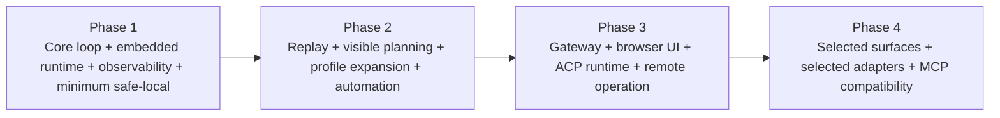

# OpenClaw Next: Work Agent Architecture

Status: Draft  
Type: Architecture-first product draft  
Position: New product, not a fork evolution plan

## 1. Thesis

OpenClaw should not be rebuilt as a lighter coding agent.

That path would inherit the wrong center of gravity: gateway-first orchestration, platform-first defaults, and a growing amount of implicit runtime behavior. Starting from that base and removing pieces would still leave a product shaped by yesterday's assumptions.

The new product should start from a different premise:

- It is a `work agent`, not a `coding agent`
- It is `code-native`, because code is its strongest execution medium
- It is `local-first`, because the default user is an individual operator, not a distributed platform
- It is `execution-oriented`, because the goal is to finish work, not to simulate intelligence

Coding remains central, but only as an execution substrate. The product should accept work goals in natural language and translate them into concrete, verifiable actions through code, scripts, tools, APIs, and files.

One-line definition:

> A local-first, code-native work agent that turns real work goals into executable actions and durable outputs.

## 2. Why A New Product

Current OpenClaw contains valuable engineering, but the product shape is wrong for the next system.

The existing codebase is a mine, not a foundation.

Useful material can be extracted from areas such as:

- session persistence patterns
- delivery and routing lessons
- cron as event injection
- bridge and remote runtime experience
- channel and surface integration knowledge

What should not be inherited as the default product shape:

- gateway as the center of the system
- multi-surface platform assumptions
- multiple agent execution semantics
- heavy implicit orchestration
- built-in prompt and workflow accretion
- default expansion into channel, automation, and platform concerns

The new system should be designed as if OpenClaw did not exist, then selectively import proven ideas where they still make sense.

## 3. Product Boundary

### 3.1 Product Definition

This product is a work execution system.

It does not exist primarily to:

- write code faster
- chat more naturally
- expose a giant tool ecosystem
- orchestrate a fleet of hidden sub-agents

It exists to help a user complete real work by turning goals into programmatic action.

Typical goals:

- clean and transform data, then produce a report
- inspect a repository, diagnose a failure, patch it, and verify the result
- turn a repeated process into a script and leave behind a reusable runbook
- gather scattered material, normalize it, and publish a structured knowledge asset
- monitor a system condition and perform repair or escalation actions

### 3.2 Default Scope

The default product handles four responsibilities:

1. Understand the work goal and its immediate operating context
2. Inspect relevant local state such as files, repos, scripts, docs, and data
3. Execute the minimum set of programmatic actions needed to advance the work
4. Persist results as durable artifacts such as code, scripts, patches, reports, logs, and notes

### 3.3 Explicit Non-Goals

The default product does not try to be:

- a multi-channel messaging platform
- a customer-support bot system
- an enterprise orchestration plane
- a hidden planner with internal todo state
- an MCP-first tool bus
- a gateway-hosted always-on server by default
- a prompt-heavy meta-agent framework

These may exist later as optional outer layers, but they must not shape the core.

## 4. Core Experience

### 4.1 Experience Principle

The user should feel they are driving a transparent computational worker, not conversing with a theatrical assistant.

The system should not optimize for the feeling of cleverness.
It should optimize for the experience of progress.

### 4.2 Default Interaction Model

The user starts with a work goal, not with implementation instructions.

Examples:

- "Turn these raw exports into a weekly operations report."
- "Audit this repo and fix the top three reliability risks."
- "Take these support notes and turn them into a searchable FAQ package."
- "Watch this folder and normalize incoming files into the correct format."

The system's default response is not to begin a ritualized planning flow.
Its default response is to enter a short work loop:

1. Understand the goal
2. Inspect only what is necessary
3. Form a minimal execution approach
4. Act through code or tools
5. Verify outcomes
6. Persist artifacts and state

### 4.3 Externalized State

The system should avoid hidden operational memory wherever possible.

Work state should be visible and versionable:

- `PLAN.md` for current intent and approach
- `TODO.md` for actionable next items
- `RUNBOOK.md` for repeatable operational procedure
- `STATUS.md` for current state and unresolved questions
- output artifacts in ordinary project files and directories

The product may maintain internal runtime state, but that state should be minimized and surfaced through logs, traces, and snapshots.

### 4.4 What Makes This Different

Compared with a standard coding agent, this product should feel different in four ways:

- it is solving a work objective, not only producing code text
- it prefers execution over recommendation
- it treats code as a means, not the end
- it leaves behind reusable assets, not only chat output

## 5. Design Principles

### 5.1 Minimal By Default

The default path must be extremely short.

No giant tool registry.
No giant system prompt.
No hidden planner.
No default orchestration fabric.

### 5.2 Complexity Must Be Opt-In

Advanced behaviors can exist, but only as explicit layers:

- optional runtime adapters
- optional gateway hosting
- optional automation/event systems
- optional remote surfaces
- optional MCP compatibility adapters

### 5.3 Code-Native Execution

The system should prefer to solve work through:

- file operations
- scripts
- shell commands
- small programs
- API calls
- generated utilities
- reusable automation artifacts

### 5.4 Observability As A First-Class Feature

The user must be able to see:

- what context was loaded
- which files were read
- which commands were executed
- which tools were used
- what changed
- why a runtime or model decision was made
- what remains uncertain

### 5.5 Local First, Network Second

The core product should run without a gateway, daemon, or remote control plane.

Networked features should wrap the core, not define it.

### 5.6 Explicit Workflows Over Hidden Agents

Sub-agents are not a primitive of the core system.

If parallel or delegated work is needed, it should be visible and explicit:

- another session
- another process
- another terminal
- another declared task context

Not an invisible internal swarm.

## 6. Core Architecture

### 6.1 Architectural Thesis

The new system should be built around a `Work Core`, with `AgentRuntime` as the execution protocol and everything else layered outward.

The architecture should look like this:

```text
+---------------------------------------------------------------+
|                        Surfaces Layer                         |
|  CLI | TUI | Web UI | Chat Surface | API Client | Remote UI   |
+---------------------------------------------------------------+
                              |
                              v
+---------------------------------------------------------------+
|                     Gateway / Access Layer                    |
|     optional HTTP, WebSocket, RPC, remote session access      |
+---------------------------------------------------------------+
                              |
                              v
+---------------------------------------------------------------+
|                  Automation / Event Injection                 |
|     cron | hooks | watchers | schedules | background jobs     |
+---------------------------------------------------------------+
                              |
                              v
+---------------------------------------------------------------+
|                          Work Core                            |
| goal intake | work loop | artifact model | state model        |
| planning-lite | execution control | verification | memory     |
+---------------------------------------------------------------+
                              |
                              v
+---------------------------------------------------------------+
|                        AgentRuntime                           |
| unified runtime contract for embedded / CLI / ACP / remote    |
+---------------------------------------------------------------+
                              |
                              v
+---------------------------------------------------------------+
|                    Execution Substrate Layer                  |
| read | patch | shell | search | api | file transforms         |
+---------------------------------------------------------------+
                              |
                              v
+---------------------------------------------------------------+
|                 Workspace / State / Artifact Layer            |
| repo | docs | data | logs | plans | outputs | snapshots       |
+---------------------------------------------------------------+
```

### 6.1.1 Structure Chart

```mermaid
flowchart TD
    User[User / Operator]
    Surfaces[Surfaces\nCLI | TUI | Web UI | Chat Surface | API Client]
    Gateway[Gateway / Access Layer\nOptional HTTP | WebSocket | RPC]
    Automation[Automation / Event Injection\nCron | Hooks | Watchers | Webhooks]
    Core[Work Core\nGoal Intake | Work Loop | Work Items | Completion]
    Runtime[AgentRuntime\nSession Plane + Execution Plane]
    Substrate[Execution Substrate\nRead | Patch | Shell | Search | HTTP]
    State[Workspace / State / Artifacts\nRepo | Docs | Data | PLAN.md | TODO.md | RUNBOOK.md | STATUS.md]
    Obs[Observability\nEvent Bus + JSONL Trace]
    Policy[Safety Policy\nsafe-local first, then vibe/platform]

    User --> Surfaces
    Surfaces --> Core
    Surfaces --> Gateway
    Gateway --> Core
    Automation --> Core
    Core --> Runtime
    Runtime --> Substrate
    Substrate --> State
    Core --> State
    Runtime --> Obs
    Core --> Obs
    Automation --> Obs
    Policy --> Core
    Policy --> Runtime
```

### 6.2 Layer Responsibilities

#### Work Core

This is the actual heart of the product.

Responsibilities:

- accept a work goal
- resolve immediate context
- maintain the short work loop
- choose the next action
- create or update visible artifacts
- evaluate whether the work objective is complete

This layer knows nothing about Telegram, Discord, or long-lived gateway hosting.
It should still function fully if all external surfaces disappear.

#### AgentRuntime

This is the execution contract between the Work Core and any specific runtime backend.

It exists to unify the semantic split that currently exists across areas like:

- `src/commands/agent.ts:678`
- `src/agents/pi-embedded-runner/run.ts:255`
- `src/acp/control-plane/manager.core.ts:593`

In the new product, the Work Core talks to exactly one runtime protocol.
Everything else becomes an adapter.

#### Execution Substrate

This layer exposes the minimum practical action surface.

Default tools should stay small:

- file read
- file patch/write
- shell execution
- search/find
- optional HTTP/API call

The substrate is intentionally narrow.
The goal is not to expose every possible capability.
The goal is to preserve focus and keep the runtime interpretable.

#### Automation / Event Injection

This layer feeds work into the core.

It does not own the core.
It does not decide the architecture.
It only injects events.

Examples:

- cron tick
- file watcher event
- webhook
- inbound email normalization
- periodic reporting trigger

The right mental model is not "cron runs the agent".
The right model is "cron injects an event into a work session".

This aligns with the strongest direction already visible in:

- `src/cron/service.ts:7`
- `src/cron/service/timer.ts:1005`

#### Gateway / Access Layer

Gateway becomes optional infrastructure.

It is no longer the default host or central nervous system.
Its job is to expose core sessions over:

- HTTP
- WebSocket
- RPC
- remote control channels

The rule is simple:

- local operation must not require gateway
- remote access must not redefine core semantics

#### Surfaces Layer

All user-facing interfaces and remote endpoints live here.

Examples:

- local CLI
- terminal UI
- browser UI
- chat surfaces
- external operator consoles

These are delivery surfaces, not product-defining layers.

### 6.3 Proposed Package Boundaries

If this becomes a new repository or monorepo, the package split should reflect the architecture instead of the old product history.

Suggested top-level modules:

- `work-core`
  Owns goal intake, work loop, artifact logic, and completion logic
- `agent-runtime`
  Defines the runtime protocol and event model
- `runtime-embedded`
  Embedded model adapter
- `runtime-cli`
  CLI-backed runtime adapter
- `runtime-acp`
  ACP-backed runtime adapter
- `exec-substrate`
  File read, patch, shell, search, and optional HTTP actions
- `state-store`
  Session metadata, runtime snapshots, artifact indexes, and logs
- `observability`
  Event model, traces, action logs, session timelines
- `automation`
  Cron, hooks, watchers, pollers, background triggers
- `gateway`
  Optional network wrapper for HTTP, WebSocket, and RPC access
- `surfaces-cli`
  Local command-line interface
- `surfaces-web`
  Optional browser or operator UI
- `adapter-mcp`
  Optional MCP compatibility layer

This package split makes one discipline explicit:

> The core must be importable and fully usable without gateway, surfaces, or automation packages.

## 7. Work Core

### 7.1 Why The Work Core Exists

Most agent systems are either:

- prompt wrappers around tools
- orchestration layers around many hidden flows
- surface-first chat systems

The Work Core is meant to prevent all three failure modes.

It should be a deliberately small deterministic center that manages the work loop and artifact lifecycle.

### 7.2 Core Responsibilities

The Work Core owns:

- goal intake
- context scoping
- artifact creation and mutation
- lightweight planning
- action selection
- execution requests
- verification requests
- completion judgment
- session state transitions

It does not own:

- chat transport
- remote protocol concerns
- plugin ecosystems
- external approval UX
- long-lived infrastructure lifecycle

### 7.3 The Work Loop

The canonical loop:

1. `Intake`
   Normalize the user's work goal, constraints, and desired output
2. `Scope`
   Decide the minimal context needed to proceed
3. `Inspect`
   Read files, data, configs, logs, or APIs as required
4. `Form`
   Produce the smallest viable execution approach
5. `Execute`
   Run actions through the execution substrate
6. `Verify`
   Test, compare, inspect, or validate the result
7. `Persist`
   Write artifacts, summaries, and reusable assets
8. `Decide`
   Stop, continue, or ask for clarification

The loop must remain short and inspectable.

### 7.3.1 Re-Entrant Session Loop

One `WorkSession` is not limited to one pass through the loop.

A single session may contain:

- multiple `Inspect -> Form -> Execute -> Verify` cycles
- multiple candidate paths before a decision is made
- multiple scoped units of work within the same goal

This is required for real work such as:

- auditing a repo and fixing the top three issues
- cleaning data in several passes
- generating outputs, validating them, then refining the pipeline

The loop is therefore re-entrant.

The correct mental model is:

- one `WorkGoal` may require several units of work
- one `WorkSession` may execute several loop iterations
- completion is judged at the session level, not after a single execute step

### 7.3.2 Work Decomposition

The `Work Core` should be allowed to decompose one `WorkGoal` into several internal units of work inside the same session.

Phase 1 does not need a complex planner for this.
It only needs a clear rule:

- decomposition happens inside one session unless there is an explicit reason to create a separate session
- each unit of work should still produce visible state, actions, and verification evidence
- the session timeline must make these units inspectable

### 7.4 Planning Philosophy

Planning exists, but only as light scaffolding.

The core should not include an elaborate plan mode.
It should instead support externalized planning through ordinary files and visible work artifacts.

The system may generate:

- `PLAN.md`
- `TODO.md`
- `RUNBOOK.md`
- `STATUS.md`

But these are part of the workspace, not a hidden planner subsystem.

### 7.4.1 Planning Artifact Ownership

Visible planning artifacts need an ownership model.

Phase 1 should choose the simplest rule that preserves clarity:

- one workspace has one active writing session at a time
- shared planning files such as `PLAN.md`, `TODO.md`, and `STATUS.md` are owned by that active session
- other concurrent sessions may read them, but should write only session-local notes or artifacts
- automation should prefer resuming the owning session rather than creating a second writer for the same shared files

This is intentionally conservative.

The goal of Phase 1 is not to solve collaborative merge semantics for planning artifacts.
The goal is to keep the work loop inspectable and avoid silent multi-writer corruption.

If concurrent writing becomes necessary later, it should be added as an explicit coordination feature rather than accidental behavior.

### 7.5 Work Object Model

The system should operate on explicit work objects, not just raw chat turns.

Core objects:

- `WorkGoal`
  The desired outcome, constraints, and success criteria
- `WorkSession`
  The active execution context for a goal
- `WorkItem`
  A scoped unit of work inside a session, used when one goal requires several passes or sub-tasks
- `Artifact`
  Any durable output such as code, script, report, dataset, patch, or document
- `Observation`
  A discovered fact about the environment or workload
- `Action`
  A concrete programmatic step
- `Verification`
  Evidence that an action moved the work toward completion
- `Decision`
  The reasoned choice to continue, stop, escalate, or re-scope

This is what makes the system a work agent rather than a chat wrapper.

### 7.5.1 WorkItem Lifecycle

`WorkItem` needs an explicit minimal state machine.

Phase 1 should keep it small:

- `pending`
- `active`
- `done`
- `skipped`
- `failed`

This is enough to answer three practical questions:

- what unit of work is currently being executed
- what remains unresolved inside the session
- whether session-level completion is actually justified

The default rule should be:

- a required `WorkItem` must be `done` or explicitly `skipped` before the session can complete
- a `failed` `WorkItem` keeps the session in `active`, `blocked`, or `failed` until the failure is resolved or explicitly accepted

### 7.5.2 Observation Lifecycle

`Observation` should have a real lifecycle.

By default:

- observations are created during `Inspect` or `Verify`
- observations are attached to the active session and, when useful, to a `WorkItem`
- observations are persisted in session state and trace records
- observations may later be promoted into an `Artifact` if they need to survive across sessions or be delivered as output

The runtime may emit observation candidates, but the `Work Core` is responsible for recording them as part of the session's durable knowledge.

When a `WorkItem` ends:

- reusable observations should be promoted into the session-level knowledge store
- item-local observations may remain attached to the item trace for replay

This ensures later `WorkItem`s can build on what earlier ones already discovered.

This keeps the system from repeatedly re-discovering facts it already established.

### 7.6 Session Lifecycle

Each work session should move through a small number of explicit states:

- `created`
- `scoped`
- `active`
- `blocked`
- `verifying`
- `completed`
- `failed`
- `cancelled`

The system should avoid hidden sub-states unless they are strictly operational.

Every transition should have:

- a reason
- a timestamp
- the triggering event or action
- any resulting artifact or unresolved issue

This turns the session into an auditable work record rather than a blob of hidden chat context.

### 7.7 Completion Model

Completion should be evidence-based.

A session is complete when the system can point to:

- the target artifact or output
- the verification result
- any known limitations
- the final persisted state

The system should not treat "the model said it is done" as completion.

### 7.7.1 Completion Authority

The `Work Core` owns completion judgment.

The runtime may emit signals such as:

- completion candidate
- blocked state
- uncertainty or verification request

But the runtime does not declare completion on its own.

This prevents completion from drifting into model self-report.

### 7.7.2 Evidence Standard

Phase 1 should use a concrete completion predicate.

A session may enter `completed` only if all of the following are true:

- the declared target artifact, output, or system change exists
- at least one verification result has been recorded
- known limitations or unresolved risks have been persisted
- the final session state has been written to durable storage

For open-ended work, the system may also require one of:

- an explicit completion criterion from the original `WorkGoal`
- a human acknowledgment step
- a policy-level completion rule for that class of work

If verification is missing or inconclusive, the session should remain `active`, `blocked`, or `verifying`, but not `completed`.

## 8. AgentRuntime

### 8.1 Goal

The runtime contract should unify every execution backend behind one protocol.

The Work Core should not care whether the runtime is:

- embedded model execution
- CLI-based execution
- ACP-backed execution
- remote hosted execution

### 8.2 Runtime Shape

The runtime protocol needs two semantic planes, even if Phase 1 keeps them inside one concrete implementation.

#### Session Plane

The session plane is responsible for:

- initialize session
- pause, resume, or cancel session
- snapshot and restore session state
- report runtime metadata
- emit lifecycle events

This plane should remain stable across adapters.

#### Execution Plane

The execution plane is responsible for:

- load visible context
- request the next action, response, or decision
- ingest tool and command results
- surface uncertainty or completion candidates
- emit execution events

This plane may vary significantly across adapters.

The architecture should recognize this distinction early, even if the first implementation exposes a single protocol surface.

### 8.3 Required Capabilities

Every runtime adapter should support the following capabilities, grouped by plane.

Session Plane:

- session init
- cancellation
- pause and resume
- state snapshotting
- runtime and policy metadata reporting

Execution Plane:

- structured turn execution
- tool result ingestion
- event emission
- completion-candidate signaling
- uncertainty and blocking signaling

### 8.4 Phase 1 Runtime Strategy

Phase 1 should ship with one concrete runtime implementation only.

The abstraction should exist from day one, but the first release should not try to prove multiple adapters at once.

Recommended order:

- ship one local embedded runtime first
- keep the protocol seam explicit
- add CLI-backed, ACP, or remote adapters only after the Work Core loop and event model are stable

This keeps the architecture honest without multiplying implementation risk too early.

### 8.5 Why This Matters

Today, OpenClaw carries multiple execution semantics.
That makes the system more powerful in aggregate, but less understandable and less composable.

The new product should make one thing true:

> There is one work runtime model, and many adapters.

Not many runtime models pretending to be one product.

### 8.6 Runtime Events

Every runtime adapter should emit the same event categories:

- `session.started`
- `workitem.started`
- `context.loaded`
- `decision.made`
- `action.requested`
- `action.completed`
- `verification.requested`
- `verification.completed`
- `workitem.completed`
- `workitem.skipped`
- `workitem.failed`
- `artifact.emitted`
- `session.blocked`
- `session.completed`
- `session.failed`
- `session.cancelled`

This event uniformity is what makes observability, gateway streaming, and automation integration coherent.

## 9. Execution Substrate

### 9.1 Default Tool Surface

The default substrate should expose only a few general-purpose tools:

- `read`
- `patch`
- `shell`
- `search`
- `http` as an optional adapter

That is enough for a large class of work.

### 9.2 Why Small Wins

More tools do not automatically create more capability.
They often create:

- more prompt overhead
- more ambiguity
- worse tool selection
- lower interpretability
- more hidden failure modes

The product should begin with the minimum surface that enables real work and only widen it when a capability clearly cannot be expressed otherwise.

### 9.3 MCP Position

MCP should not be the center of the system.

It should exist only as a compatibility layer.

Rules:

- no default MCP registry injection
- no giant tool schema in the base prompt
- MCP adapters load only when explicitly enabled
- CLI tools and explicit adapters are preferred over implicit remote capability surfaces

MCP is useful at the edge.
It should not be the language the core thinks in.

## 10. State Model

### 10.1 Visible State

The primary state should live in ordinary files and artifacts.

Examples:

- `PLAN.md`
- `TODO.md`
- `RUNBOOK.md`
- `STATUS.md`
- output directories
- generated scripts
- verification reports
- logs and traces

### 10.2 Internal State

Internal state should be kept small and purpose-specific:

- active session metadata
- runtime snapshots
- event queues
- model/policy metadata
- cancellation tokens

Internal state exists to run the system, not to become a second hidden workspace.

### 10.3 Artifact-First Memory

The system should remember through durable artifacts first.

That means it should prefer:

- writing a reusable script
- saving a normalized dataset
- updating a runbook
- leaving a verification note
- persisting a structured output

over merely "remembering" through prompt context.

### 10.4 Session-Local Versus Workspace-Shared State

The state model should explicitly distinguish:

- workspace-shared artifacts
- session-local artifacts

Workspace-shared artifacts include:

- `PLAN.md`
- `TODO.md`
- `RUNBOOK.md`
- `STATUS.md`
- shared outputs intended to survive across sessions

Session-local artifacts include:

- scratch notes
- transient investigation logs
- per-session traces
- temporary derived files

Phase 1 should bias toward session-local writes unless a session has clear ownership over a shared workspace artifact.

This rule is a guardrail against the Work Core quietly becoming a hidden multi-agent planner.

## 11. Observability

### 11.1 Non-Negotiable Requirement

Observability is not a debugging feature.
It is a product feature.

The user must be able to inspect:

- loaded context
- tool calls
- command arguments
- file diffs
- model choice
- runtime path choice
- injected events
- verification results
- unresolved uncertainty

### 11.2 Event Types

Observability needs both a live transport and a durable canonical record.

Phase 1 should adopt this model:

- an in-process event bus for live consumers such as CLI, TUI, gateway, and automation hooks
- an append-only structured trace on disk as the canonical replay source

The canonical on-disk format should be newline-delimited structured events such as `JSONL`.

This gives the system:

- low-friction live streaming
- cheap persistence
- replayability
- tool-independent inspection
- a stable basis for later remote transport

### 11.2.1 Event Envelope

Each persisted event should carry at least:

- event id
- timestamp
- session id
- work goal id
- work item id when applicable
- event type
- source layer
- causality reference when applicable
- artifact references when applicable
- payload
- policy or runtime metadata when relevant

The system should emit structured events for:

- goal accepted
- workitem started, completed, skipped, or failed
- context loaded
- file read
- patch applied
- command executed
- runtime selected
- model selected
- event injected
- verification passed or failed
- artifact emitted
- session paused, resumed, stopped

### 11.3 User Experience

The user should never have to ask:

- "Why did it read that?"
- "Why did it switch models?"
- "Why did it call that tool?"
- "Why did this run remotely?"

Those answers should already be visible.

### 11.4 Storage And Replay

Observability should support both live inspection and post-hoc replay.

The system should retain enough structured information to reconstruct:

- what the session knew at each step
- why it chose its next action
- what changed in the workspace
- which checks passed or failed

That implies keeping:

- structured event logs
- command execution metadata
- artifact references
- diff summaries
- verification outputs

The trace should be compact, but it should be real.

### 11.5 Design Rule

If a feature cannot explain itself through the event model, it is not fully designed yet.

That applies to:

- runtime selection
- model selection
- completion judgment
- policy enforcement
- automation injection

Observability is therefore part of core architecture, not an adapter concern.

### 11.5.1 Enforcement Mechanism

This rule needs an implementation-time gate.

Phase 1 should enforce it in three ways:

- design gate: every new core capability must declare the events it emits, the persisted fields it adds to the trace, and how it appears in replay
- review gate: changes to Work Core, runtime behavior, automation injection, or policy handling should be rejected if they add behavior with no event representation
- contract tests: the core event pipeline should have tests that assert critical actions are reflected in persisted trace output

This is intentionally strict.

Without an explicit gate, observability will collapse back into a debug feature under delivery pressure.

## 12. Security Profiles

Security should be profile-based, not woven into every path as heavy default friction.

Three starting profiles are enough:

### 12.1 `vibe`

- optimized for speed and experimentation
- relaxed execution restrictions
- maximum transparency, minimum friction

### 12.2 `safe-local`

- default profile for serious individual use
- local execution preferred
- constrained write and command surfaces
- explicit visibility for sensitive actions

### 12.3 `platform`

- for remote hosting or shared operation
- stronger policy controls
- stricter boundary enforcement
- suitable for gateway and surface exposure

The profile changes the safety envelope.
It should not change the identity of the core product.

### 12.4 Policy Model

Profiles should be mutually exclusive at the session level, with explicit per-session overrides where needed.

Policy should come from two places only:

- the selected profile
- an optional explicit policy file or session override

The system should not accumulate hidden approval state in scattered runtime branches.

### 12.5 Action Categories

Phase 1 should classify actions at least into:

- read
- patch or write
- shell execution
- network access
- remote attach or gateway exposure

### 12.6 Initial Profile Matrix

| Profile | Read | Patch/Write | Shell | Network | Remote Attach | Approval Model |
| --- | --- | --- | --- | --- | --- | --- |
| `vibe` | allowed | allowed in workspace | allowed | opt-in by config | disabled by default | no interactive approval by default; rely on visibility |
| `safe-local` | allowed | allowed in workspace-scoped targets | allowed with sensitive-action confirmation | disabled unless explicitly enabled | disabled by default | interactive confirmation plus policy file support |
| `platform` | allowed by policy | allowed only by scoped policy | denied unless explicitly granted | denied unless explicitly granted | allowed with auth and policy | policy-first, confirmation optional but not primary |

This matrix is intentionally simple.
Its job is to shape default behavior, not to become a policy engine in v1.

### 12.6.1 Phase Sequencing

Phase 1 should implement only the minimum `safe-local` profile needed to establish a real safety boundary.

That includes:

- workspace-scoped writes
- confirmation for consequential shell actions
- explicit disable-by-default treatment for network and remote attach

`vibe` and `platform` should be treated as Phase 2 profile expansions, not Phase 1 requirements.

### 12.6.2 Safe-Local Confirmation UX

`safe-local` needs a concrete default interaction.

Phase 1 should use a blocking terminal confirmation for consequential shell actions.

The confirmation should show:

- the exact command
- the working directory
- the risk label or action category
- a short reason for why the action is being requested

The user should have at least these choices:

- allow once
- allow for this session
- deny

Session-scoped approvals should live only for the current session unless they are explicitly written into a policy file.

This is deliberately simple.
The goal is to make `safe-local` feel predictable, not to build a full approval platform.

## 13. Gateway

### 13.1 Reframed Role

Gateway is not the product center.
Gateway is an access wrapper around the core.

Its purpose is to expose sessions and execution over network protocols without redefining the work model.

### 13.2 Responsibilities

- remote session access
- transport and authentication
- state streaming
- operator clients
- optional remote surfaces

### 13.3 Hard Rule

A local user should be able to use the full core product without ever starting gateway.

If the core requires gateway, the architecture has already failed.

## 14. Automations

### 14.1 Role

Automation systems are event sources.

They should inject work, not replace the work model.

### 14.2 Examples

- cron schedules
- folder watchers
- webhook receivers
- polling jobs
- external trigger bridges

### 14.3 Rule

No automation subsystem should invent its own execution semantics.

It should always target:

- a `WorkGoal`
- a `WorkSession`
- or an event consumed by the Work Core

## 15. Surfaces

Surfaces are how users and systems interact with the core.

They are not the core itself.

Initial surfaces may include:

- CLI
- terminal UI
- browser UI
- HTTP client
- optional chat or operator interfaces

The product should be designed so surfaces remain replaceable.

## 16. Migration Mindset

This is not a rewrite-in-place.

This should live as a new project boundary:

- preferably a new repository
- at minimum a new top-level package namespace with architectural isolation

It should not begin life as another feature area inside the old product shape.

The current fork should be treated as:

- a reference implementation library
- a source of proven mechanisms
- a place to mine patterns, not preserve product form

Good candidates to mine:

- session persistence ideas
- bridge and runtime lessons
- cron and event delivery patterns
- some routing and surface concepts

Bad candidates to inherit unchanged:

- gateway-centered startup model
- platform-first runtime assumptions
- accumulated tool and prompt complexity
- mixed execution semantics

## 17. Non-Goals

This product is not trying to:

- become an everything-platform in v1
- support every chat surface by default
- expose dozens of tools on day one
- standardize every workflow into a built-in SOP
- simulate autonomous intelligence through opaque orchestration

Its job is narrower and stronger:

> accept work, execute through code-native means, and leave behind durable results.

## 18. MVP Shape

The first real version should probably include only:

- local CLI or TUI surface
- Work Core
- one unified AgentRuntime
- minimal execution substrate
- visible artifact/state files
- structured observability
- minimum `safe-local` safety
- optional cron-style event injection

Phase 1 should ship exactly one runtime:

- a local embedded runtime under the unified `AgentRuntime` protocol
  
The embedded-first choice is about control.
It gives the system full control over eventing, tool mediation, and completion semantics before adapter complexity is introduced.

It should probably exclude:

- full gateway by default
- broad MCP ecosystem support
- multi-channel messaging surfaces
- hidden sub-agent orchestration
- enterprise control-plane concerns

### 18.1 What Phase 1 Ship Means

Phase 1 ship should mean:

- an installable alpha-quality local product
- usable by a single operator outside the authoring environment
- able to complete an end-to-end work loop on real work
- able to persist artifacts and replay traces
- able to enforce the minimum `safe-local` boundary

It does not need to mean:

- public platform launch
- broad adapter ecosystem
- remote multi-user deployment
- enterprise policy completeness

## 19. End-To-End Flows

### 19.1 Local Interactive Flow

The default local path should look like this:

1. User submits a work goal from CLI or TUI
2. Work Core creates a `WorkSession`
3. Work Core scopes and inspects local context
4. AgentRuntime produces the next action
5. Execution Substrate performs the action
6. Observability records the event
7. Verification checks the result
8. Artifacts and visible state files are updated
9. Session stops or continues

This is the product's most important path.
If this path ever becomes bloated, the architecture is drifting.

### 19.2 Event-Driven Flow

An automated path should look like this:

1. Cron, watcher, or webhook emits an event
2. Automation layer creates or resumes a target work session
3. Work Core translates the event into a scoped work goal
4. The normal work loop runs
5. Artifacts are persisted
6. Optional notifications are sent outward through a surface or gateway

This keeps automation subordinate to the same core semantics.

### 19.2.1 Automation Handoff Rule

Automation must not reintroduce hidden multi-writer behavior.

Phase 1 should use this handoff rule:

- if the target goal already has an active writing session, automation does not create a second writer; it appends or queues an event for that session
- if the target goal has a paused or blocked session and policy allows, automation should resume that session
- only if no active session exists for the target goal may automation create a new session

The session target should be resolved from a stable goal or binding key, not from whatever runtime happens to be active at the time.

This keeps event injection subordinate to session ownership instead of silently bypassing it.

### 19.3 Remote Operator Flow

An optional remote path should look like this:

1. Remote client connects through gateway
2. Gateway authenticates and attaches to a work session
3. Gateway streams structured events and accepts user control
4. Work Core and AgentRuntime continue unchanged
5. Gateway disconnects without affecting session semantics

That last point matters.
Gateway is transport, not ontology.

## 20. Build Order

The build order should preserve the product thesis.

### Phase 1

- define `WorkGoal`, `WorkSession`, `WorkItem`, `Artifact`, `Observation`, `Action`, `Verification`
- implement Work Core
- define AgentRuntime protocol
- implement one concrete local embedded runtime
- implement minimal execution substrate
- add structured observability
- implement minimum `safe-local` profile
- ship local CLI or TUI

### Phase 2

- add state snapshots and replay
- add visible planning and runbook artifacts
- add `vibe` and `platform` profile variants
- add cron and event injection
- harden verification flows

### 20.1 Build Order Chart



### Phase 3

- add optional gateway
- add optional browser UI
- add optional ACP runtime adapter
- add optional remote operation

### Phase 4

- add selected surfaces
- add selected external adapters
- add optional MCP compatibility layer

The order is strategic.
It prevents outer layers from setting the identity of the system too early.

## 21. Success Criteria

The new system is on the right path when:

- a user can complete real work without learning a framework
- the default runtime path can be explained in a few minutes
- every important action is visible
- state is mostly artifact-backed rather than prompt-backed
- remote and automation features feel layered on, not invasive
- the system solves more than coding while still using code as its main execution medium

## 22. Final Position

The central strategic move is not "simplify OpenClaw".

It is:

1. define a new product as a work agent
2. make code-native execution the core advantage
3. make the local short work loop the center
4. move gateway, automation, and surfaces outward
5. mine the old system for parts, not identity

If this is done correctly, the result will not feel like a smaller OpenClaw.
It will feel like a new category of tool:

a work system whose native language happens to be code.
