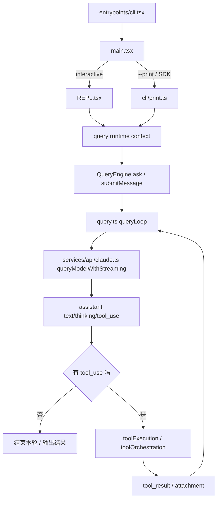

# 核心 Agent Runtime 总览

> 基于 Claude Code v2.1.88 反编译源码分析  
> 聚焦范围：`main.tsx`、`QueryEngine.ts`、`query.ts`、`services/api/claude.ts`、`services/tools/*`、`services/mcp/client.ts`、`cli/print.ts`、`cli/structuredIO.ts`

## 一句话结论

这个项目最有价值的部分，不是某个单独工具，也不是某个 TUI 组件，而是一套完整的终端代理运行时：

1. 它把 CLI、REPL、headless、SDK、远程桥接收敛到同一条 agent 主链路。
2. 它把“模型采样”和“工具执行”做成一个可递归、可恢复、可预算、可权限控制的 turn machine。
3. 它把本地工具、MCP 工具、技能、子代理、会话持久化和远程 transport 全部接到同一个会话模型里。

如果你要复刻一个工程级别的 coding agent，这套 runtime 比单个 prompt 或单个 tool 更值得参考。

## 1. 这套系统的分层

从代码上看，核心可以拆成 7 层：

### 第 1 层：CLI 启动与模式分流

- `src/entrypoints/cli.tsx`
- `src/main.tsx`

职责：

- 处理最快路径入口，比如 `--version`、daemon worker、bridge、background session。
- 构造 `claude` 顶层命令和所有命令行选项。
- 决定走交互式 REPL 还是 `--print`/SDK 模式。

关键点：

- `src/entrypoints/cli.tsx` 是真正的 bootstrap，先做 fast-path 分流，再决定是否加载完整 CLI。
- `src/main.tsx:884-1006` 定义了主程序和几乎所有用户可见的 CLI 选项。
- `src/main.tsx:2584-2615` 在 `--print` 模式下初始化非交互链路。

### 第 2 层：会话壳层

- 交互式：`src/screens/REPL.tsx`
- 非交互式：`src/cli/print.ts`

职责：

- 把“用户输入 / 远程输入 / stdin 输入”接进同一会话。
- 把输出渲染到 REPL UI、stdout stream-json，或者远程 bridge。
- 为核心 query runtime 提供 `AppState`、权限、MCP、任务、通知、session storage 等上下文。

关键点：

- 交互和非交互不是两套业务实现，只是两个不同的壳层。
- 非交互模式最终仍然调用 `ask()`/`QueryEngine`，只是多了一层 `StructuredIO` 协议适配。

### 第 3 层：单会话运行时

- `src/QueryEngine.ts`

职责：

- 管理一个 conversation 的完整生命周期。
- 处理用户输入、slash command、副作用附件、会话持久化、SDK 消息格式化。
- 调用底层 `query()` 进入真正的 agent loop。

关键点：

- `QueryEngine` 是“会话协调器”，不是“模型采样器”。
- 它负责的是会话边界、消息数组、状态同步和最终结果格式。

### 第 4 层：turn machine / agent loop

- `src/query.ts`

职责：

- 真正执行一轮又一轮的 agent turn。
- 在每个 turn 中做上下文整理、token budget、自动 compact、调用模型、执行工具、插入附件、决定是否递归下一轮。

关键点：

- 这里才是系统的核心控制流。
- 它不是“一次请求，一次响应”，而是“采样 -> tool_use -> tool_result -> 继续采样”的循环机器。

### 第 5 层：模型流式接口

- `src/services/api/claude.ts`
- `src/services/api/client.ts`

职责：

- 组装 Messages API 请求。
- 处理流式返回，自己拼 `text`、`thinking`、`tool_use` 等内容块。
- 跟踪 usage、stop_reason、fallback、watchdog、streaming error。

关键点：

- 这里没有把 SDK 当黑盒直接消费高层对象，而是主动解析原始流事件。
- 这样才能把工具执行、恢复、usage 统计、stop reason 和 transcript 时序完全控在自己手里。

### 第 6 层：工具运行时

- `src/Tool.ts`
- `src/tools.ts`
- `src/services/tools/toolExecution.ts`
- `src/services/tools/toolOrchestration.ts`
- `src/services/tools/StreamingToolExecutor.ts`

职责：

- 定义统一 Tool 抽象。
- 合并 built-in 工具和 MCP 工具。
- 做输入验证、权限检查、hook、并发调度、tool_result 回写。

关键点：

- 这层把“LLM 工具调用”变成“有权限边界、有状态语义、有并发约束的执行系统”。

### 第 7 层：MCP / SDK / 远程桥接

- `src/services/mcp/client.ts`
- `src/cli/structuredIO.ts`
- `src/cli/remoteIO.ts`
- `src/cli/transports/*`

职责：

- 把 MCP server 暴露的工具包装成本地 Tool。
- 把 SDK host、bridge、远程 transport 的权限流和控制流接进来。
- 让 headless、SDK、bridge 和本地 CLI 共享同一套 agent runtime。

关键点：

- MCP 不是外挂。
- SDK 模式也不是旁路。
- 它们被设计成 runtime 的一级组成部分。

## 2. 从启动到一次完整 agent turn 的主链

可以把主链压缩成下面这张图：

这张图反映的是三个核心事实：

1. `QueryEngine` 只管“会话壳”，`query.ts` 才是控制循环。
2. `claude.ts` 负责把流式 API 变成内部消息对象。
3. 工具执行结果不会直接交给用户，而是重新进入消息流，继续驱动下一轮模型采样。

## 3. 为什么说真正核心是 agent loop

用户表面看到的是：

- 输入一个 prompt
- Claude 回答
- 中途可能执行工具

但从代码结构看，这其实是一个显式状态机：

1. 接收输入。
2. 组装 system prompt、user context、tool list。
3. 在调用模型前做 memory/skill 预取与上下文压缩。
4. 流式解析模型输出。
5. 如果出现 `tool_use`，立即进入工具调度层。
6. 产生 `tool_result`、attachment、summary、queued command 等消息。
7. 把这些消息重新拼回上下文。
8. 继续下一轮，直到没有 follow-up、预算超限、达到 max turns 或异常结束。

这套设计的价值在于：它把 agent 行为从“prompt 技巧”提升成了“可工程化的执行内核”。

## 4. 这套 runtime 最值得参考的设计点

### 4.1 会话壳与 agent loop 分离

`QueryEngine` 不直接承担模型流处理，而是把核心循环委托给 `query()`。

好处：

- REPL 和 headless 可以共享主逻辑。
- SDK 模式只需要换 IO 协议，不需要重写工具/模型循环。
- session persistence、ack、result packaging 可以独立演进。

### 4.2 模型流式解析是内部自管，不外包给 SDK 高层抽象

`services/api/claude.ts` 直接读取 `BetaRawMessageStreamEvent`，自己积累内容块、usage、stop_reason。

好处：

- 能精确控制 `tool_use` 的输入拼接。
- 能处理 streaming fallback、idle watchdog、partial assistant message。
- 能在 transcript 和 SDK 输出之间保持严格时序。

### 4.3 tool runtime 不是“函数调用”，而是“受控执行系统”

工具调用要经过：

1. schema 校验
2. tool-specific validate
3. pre-tool hooks
4. permission decision
5. 执行
6. post-tool hooks
7. 结果映射回 `tool_result`

这比绝大多数 demo agent 高一个层级，因为它解决了真正会在线上爆炸的问题：

- 非法参数
- 权限流阻塞
- 多工具并发时的状态污染
- transcript 重放一致性
- 取消、中断、fallback 时的 orphan result

### 4.4 MCP 被彻底 runtime 化

MCP 工具会被动态包装成标准 `Tool`，包括：

- 名字
- 描述
- JSON schema
- 并发安全
- destructive/open-world hint
- 权限建议
- call 行为

这意味着模型不需要知道“这是本地工具还是远端工具”，它只看到统一的工具平面。

### 4.5 print/SDK 模式不是阉割版

很多项目的 headless 模式只是“把最后回答打印出来”。这里不是。

这里的 print/SDK 模式：

- 也能走完整的 tool use
- 也能处理中断与权限
- 也能接 MCP elicitation
- 也能通过 `StructuredIO` 转成控制协议

所以它本质上是在输出一个“agent runtime protocol”，而不是一个简单 CLI。

## 5. 这几份后续文档各自负责什么

为了避免一份文档过长，后面的深挖会分别展开：

1. `07-QueryEngine-与-query-loop-拆解.md`
   - 讲 `QueryEngine -> ask() -> query()` 的完整 turn 生命周期。
   - 重点拆 system prompt、消息持久化、compact、memory/skill prefetch、递归继续条件。

2. `08-工具执行-权限-并发-与-StreamingToolExecutor.md`
   - 讲 `Tool` 抽象、工具池、权限模型、串并发规则、streaming tool execution。

3. `09-MCP-StructuredIO-与-Print-SDK-桥接.md`
   - 讲 MCP 动态包装、URL elicitation、`StructuredIO` 协议、permission prompt 桥接、print/SDK/remote transport 关系。

## 6. 如果你要复刻它，最先该抄的不是哪个工具

建议优先参考的顺序是：

1. `src/query.ts`
2. `src/QueryEngine.ts`
3. `src/services/api/claude.ts`
4. `src/services/tools/toolExecution.ts`
5. `src/services/tools/StreamingToolExecutor.ts`
6. `src/services/mcp/client.ts`
7. `src/cli/structuredIO.ts`

原因很简单：

- 工具种类可以以后慢慢加。
- prompt 可以以后慢慢调。
- UI 可以以后慢慢做。

但如果一开始没有把 turn machine、tool runtime、权限流、MCP 包装和 headless 协议设计好，后面几乎一定会推倒重来。

## 7. 核心源文件索引

- CLI 启动与模式分流：`src/entrypoints/cli.tsx`, `src/main.tsx`
- 会话运行时：`src/QueryEngine.ts`
- agent loop：`src/query.ts`
- 模型流式层：`src/services/api/claude.ts`, `src/services/api/client.ts`
- 工具系统：`src/Tool.ts`, `src/tools.ts`, `src/services/tools/*`
- MCP：`src/services/mcp/client.ts`
- print/SDK 协议：`src/cli/print.ts`, `src/cli/structuredIO.ts`, `src/cli/transports/*`

