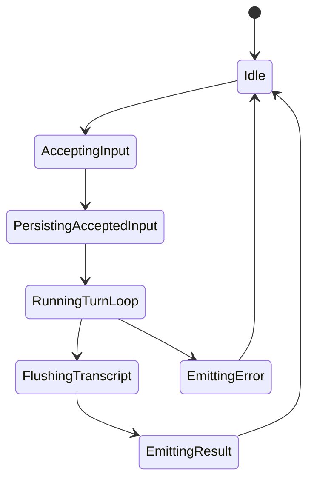
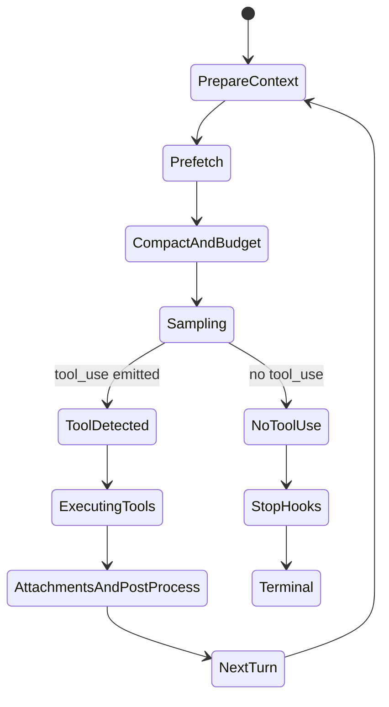
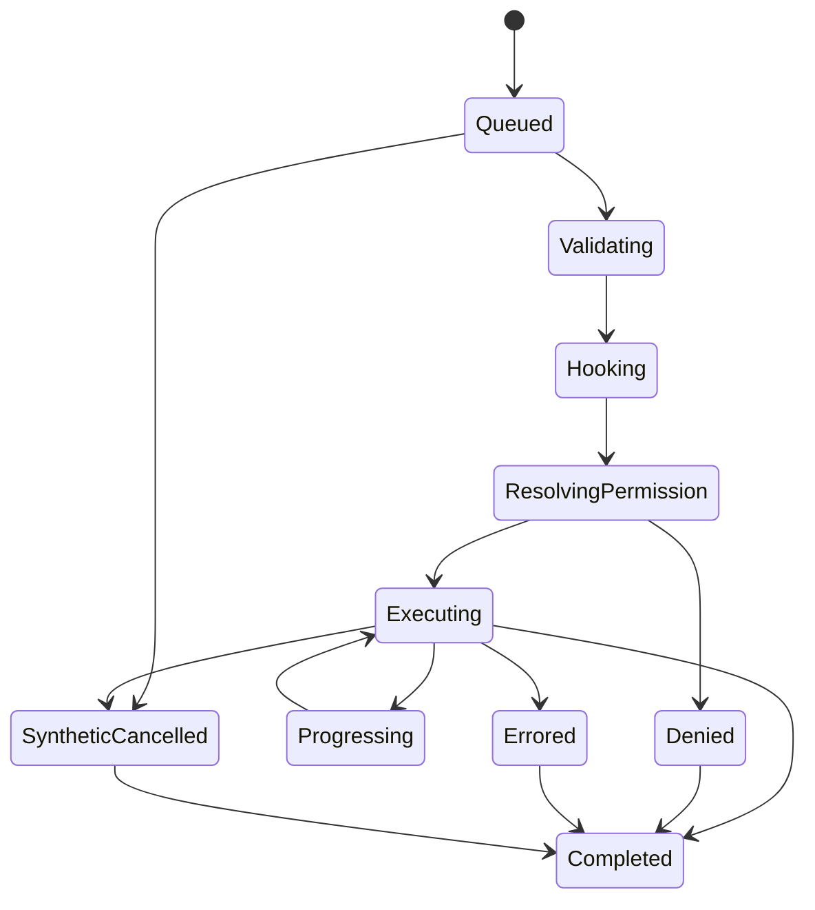

# Agent Runtime 硬核复刻总规范

> 基于 Claude Code v2.1.88 反编译源码分析  
> 核心来源：`src/main.tsx`、`src/QueryEngine.ts`、`src/query.ts`、`src/services/api/claude.ts`、`src/services/tools/*`、`src/services/mcp/client.ts`、`src/cli/structuredIO.ts`、`src/cli/print.ts`

## 0. 这份文档是干什么的

前面的文档已经把源码拆开讲过了。

这一份不是“继续分析源码”，而是把最关键的工程知识压成一份可复刻规范。它回答的是下面这些更硬的问题：

1. 如果我要自己做一套工程级 agent runtime，哪些边界必须照着学？
2. 这套系统真正的核心不变量是什么？
3. 哪些地方不能偷懒，否则很快会烂成两套逻辑？
4. 如果我要实现一个最小可行版本，核心模块应该怎么切？
5. 如果我要实现接近 Claude Code 级别的系统，状态机和失败语义应该怎么建？

一句话说，这是一份“架构规范 + 复刻约束 + 控制流蓝图”。

## 1. 先下结论：这个项目真正提供的是什么

这个项目真正提供的不是：

- 一个命令行聊天壳
- 一堆本地工具
- 一个 Anthropic API 封装

它真正提供的是一套统一 agent runtime，满足下面 5 个条件：

1. 同一条 agent 主链路可被 REPL、headless、SDK、remote bridge 复用。
2. 同一条消息轨迹能安全承载 `text`、`thinking`、`tool_use`、`tool_result`、attachments、compact boundary。
3. 同一套工具抽象能同时承载 built-in 工具和 MCP 工具。
4. 同一套权限与 hook 逻辑能同时承载本地交互、SDK 弹窗、remote control。
5. 同一条 transcript 可以被恢复、裁剪、继续执行，而不会在异常中裂开。

如果你复刻的是“能调用几个工具的聊天程序”，你学到的是表层。

如果你复刻的是“统一 runtime”，你学到的才是项目真正值钱的东西。

## 2. 复刻时必须坚持的 12 条核心不变量

这些不是风格建议，而是会直接决定系统会不会烂掉的硬约束。

### 1. CLI 不是业务层

CLI 只能做：

- 参数解析
- 模式分流
- 环境装配

CLI 不能做：

- 直接驱动模型
- 直接执行工具
- 自己维护第二套会话状态

来源：

- `src/entrypoints/cli.tsx`
- `src/main.tsx:884-1006`
- `src/main.tsx:2584-2615`

### 2. 会话状态必须有单一所有者

必须有一个会话对象统一持有：

- 当前消息数组
- read file state
- permission denials
- usage
- transcript 写入上下文

来源：

- `src/QueryEngine.ts:184-620`

### 3. turn loop 必须独立于会话壳层

`submitMessage()` 和 `queryLoop()` 不能混成一个巨函数。

否则：

- slash command
- transcript
- SDK replay
- compact
- tool recursion

会全部纠缠在一起，后面无法扩展。

来源：

- `src/QueryEngine.ts:209-620`
- `src/query.ts:241-305`

### 4. API streaming 必须自己组块

不能完全把：

- `text`
- `thinking`
- `tool_use`
- `stop_reason`
- usage

的时序交给上游 SDK。

来源：

- `src/services/api/claude.ts:1780-1875`
- `src/services/api/claude.ts:1975-2065`

### 5. 工具层不是简单函数调用

工具执行至少要经过：

1. tool lookup
2. input schema parse
3. tool-specific validate
4. pre-tool hooks
5. permission resolve
6. progress/result emission
7. post-tool hooks
8. `tool_result` 回写

来源：

- `src/services/tools/toolExecution.ts:337-520`
- `src/services/tools/toolExecution.ts:635-1175`

### 6. 工具并发必须受工具语义约束

不能统一 `Promise.all`。

必须区分：

- 可并发只读工具
- 独占式写状态工具

来源：

- `src/services/tools/toolOrchestration.ts:1-188`
- `src/services/tools/StreamingToolExecutor.ts:35-212`

### 7. `tool_use` 必须最终配对 `tool_result`

无论结果是：

- 成功
- 输入校验失败
- 权限拒绝
- hook stop
- 中断
- streaming fallback discard

都必须有对应的 `tool_result` 或等价终止信号，否则 transcript / resume 会坏。

来源：

- `src/query.ts:1011-1051`
- `src/services/tools/toolExecution.ts:337-520`
- `src/services/tools/StreamingToolExecutor.ts:145-212`

### 8. transcript 写入必须早于“看起来成功”

用户消息一被接受，就要尽快进入 transcript。

否则进程在 API 返回前被杀，resume 会拿不到用户最后一条消息。

来源：

- `src/QueryEngine.ts:393-427`

### 9. compact boundary 必须是 runtime 一等公民

compact 不是后台整理，而是主链路事件。

它必须：

- 可进入 transcript
- 可进入 SDK stream
- 可触发 message pruning
- 可被 resume 理解

来源：

- `src/query.ts:365-430`
- `src/QueryEngine.ts:686-714`
- `src/QueryEngine.ts:820-851`

### 10. print / SDK / remote 只能替换 IO，不许复制主逻辑

如果 headless 场景单独重写一套 agent loop，后续必然分叉。

来源：

- `src/cli/print.ts:2170-2215`
- `src/QueryEngine.ts:1186-1288`
- `src/cli/structuredIO.ts:533-634`

### 11. MCP 必须统一收编为 `Tool`

MCP 不应成为第二条工具系统。

来源：

- `src/services/mcp/client.ts:1744-1878`

### 12. 失败处理必须先维护一致性，再考虑体验

比如：

- streaming fallback 先 discard 旧工具，再 retry
- 用户中断先补终止语义，再停止续轮
- Bash 失败先中止 sibling，再保证 transcript 不断裂

来源：

- `src/query.ts:657-735`
- `src/query.ts:1011-1051`
- `src/services/tools/StreamingToolExecutor.ts:145-212`

## 3. 统一架构模型

复刻时建议把整套系统切成 8 个模块：

1. `AppShell`
2. `SessionEngine`
3. `AgentLoop`
4. `ModelStreamAdapter`
5. `ToolRuntime`
6. `PermissionBridge`
7. `TranscriptStore`
8. `ToolRegistry`

### 3.1 模块职责

#### `AppShell`

负责：

- CLI / REPL / SDK / remote 接口
- 构造依赖
- 把输入喂给 `SessionEngine`

不负责：

- turn 递归
- 模型 streaming 状态机
- 工具执行语义

#### `SessionEngine`

负责：

- 会话级状态
- `submitMessage()`
- 用户输入处理
- transcript 早写入
- system init message
- 最终 result 包装

不负责：

- 真正的 turn loop
- 工具并发调度

#### `AgentLoop`

负责：

- 一轮轮 turn
- prefetch
- compact
- budget
- 调模型
- 决定是否执行工具
- 递归下一轮

#### `ModelStreamAdapter`

负责：

- 与 provider 通信
- 消费流事件
- 组装 assistant block
- usage 聚合
- fallback 到 non-streaming

#### `ToolRuntime`

负责：

- 查找工具
- 校验输入
- hooks
- permissions
- 执行工具
- progress / result / context modifier

#### `PermissionBridge`

负责：

- 本地交互权限
- SDK/StructuredIO 权限
- hook 决策
- permission prompt race

#### `TranscriptStore`

负责：

- append-only transcript
- flush
- compact boundary 记录
- resume 所需链路一致性

#### `ToolRegistry`

负责：

- built-in tool registry
- MCP tool wrapping
- refresh tools
- name / alias / metadata 统一

## 4. 统一控制流

下面这张图是最关键的主时序。

```mermaid
sequenceDiagram
  participant User as User / SDK Host
  participant Shell as AppShell
  participant Session as SessionEngine
  participant Loop as AgentLoop
  participant API as ModelStreamAdapter
  participant Tools as ToolRuntime
  participant Perm as PermissionBridge
  participant Store as TranscriptStore

  User->>Shell: input / prompt
  Shell->>Session: submitMessage(prompt)
  Session->>Store: append accepted user messages
  Session->>Loop: query(messages, systemPrompt, toolContext)

  loop per turn
    Loop->>Loop: prefetch memory / skills
    Loop->>Loop: compact / budget / attachment prep
    Loop->>API: sample(messages, tools, model config)
    API-->>Loop: stream text / thinking / tool_use / usage
    alt no tool_use
      Loop-->>Session: final assistant trajectory
    else has tool_use
      Loop->>Tools: execute(tool_use[])
      Tools->>Perm: resolve permission
      Perm-->>Tools: allow / deny / ask / updatedInput
      Tools-->>Loop: progress + tool_result + context updates
      Loop->>Loop: append attachments / tool_result
      Loop->>Loop: continue next turn
    end
  end

  Session->>Store: flush transcript
  Session-->>Shell: SDK/result messages
  Shell-->>User: output stream
```

读这张图时要注意：

1. `SessionEngine` 不是 sampling 层。
2. `AgentLoop` 不是权限层。
3. `ToolRuntime` 不决定整个会话结束，只负责执行与回写。
4. print/SDK 只在 `Shell` 和 `PermissionBridge` 层换壳。

## 5. 三层状态机

这套系统至少有三层状态机，不能混。

### 5.1 会话状态机



### 5.2 单轮 turn 状态机



### 5.3 单个工具状态机



关键点：

- `Denied` 不是“没有结果”，而是生成 error `tool_result` 后结束。
- `SyntheticCancelled` 不是异常，是 transcript 一致性所需的补偿语义。

## 6. 数据模型应该怎么切

复刻时，建议至少分清 4 类数据：

### 6.1 Conversation Log

这是逻辑消息轨迹，包含：

- user
- assistant
- system
- progress
- attachment
- tool summary
- compact boundary

用途：

- 驱动下轮模型上下文
- transcript 持久化
- SDK stream 输出

### 6.2 Turn State

只在单次 query loop 中有效，包含：

- 当前 `messages`
- `toolUseContext`
- `turnCount`
- `autoCompactTracking`
- `pendingToolUseSummary`
- `maxOutputTokensRecoveryCount`

来源：

- `src/query.ts:241-305`

### 6.3 Tool Runtime State

只在一批工具执行期间有效，包含：

- 工具队列
- 执行中工具
- pending progress
- context modifiers
- sibling abort controller

来源：

- `src/services/tools/StreamingToolExecutor.ts:35-212`

### 6.4 External Control State

只在 SDK / remote 场景显式存在，包含：

- pending permission requests
- control request / response
- resolved tool use ids
- elicitation callbacks

来源：

- `src/cli/structuredIO.ts:116-240`
- `src/cli/structuredIO.ts:520-760`

## 7. 你必须保住的消息语义

很多项目的问题不是 agent 不会跑，而是消息语义不稳定。

这里最关键的有 7 条：

### 1. assistant trajectory 不是一条字符串

assistant 轨迹必须允许：

- 多个 `text` block
- `thinking`
- `tool_use`
- stop reason 迟到更新

来源：

- `src/services/api/claude.ts:1780-2065`

### 2. `tool_result` 是用户侧消息，不是 assistant 侧消息

这决定了 transcript、resume、下一轮 prompt 组装方式。

来源：

- `src/query.ts:1380-1455`
- `src/services/tools/toolExecution.ts:337-520`

### 3. progress 也是一等消息

progress 不能只是 UI 临时状态。

它必须能：

- 进入内存消息列表
- 必要时进入 transcript
- 被 SDK/remote 感知

来源：

- `src/QueryEngine.ts:748-768`
- `src/services/tools/toolExecution.ts:492-569`

### 4. attachment 不是 UI 装饰，而是下一轮上下文的一部分

例如：

- queued command
- edited file
- structured output
- max_turns_reached
- memory attachment

来源：

- `src/query.ts:1499-1640`
- `src/QueryEngine.ts:805-851`

### 5. `compact_boundary` 必须显式可见

不能只是“后台替换了数组”。

来源：

- `src/query.ts:365-430`
- `src/QueryEngine.ts:820-851`

### 6. SDK result 不是 assistant 最后一条消息的简单镜像

最终 `result` 还携带：

- duration
- API duration
- num turns
- stop reason
- usage
- total cost
- permission denials
- fast mode state

来源：

- `src/QueryEngine.ts:619-631`
- `src/QueryEngine.ts:1084-1137`

### 7. 错误也必须通过消息协议表达

例如：

- `error_max_turns`
- `error_max_budget_usd`
- `error_max_structured_output_retries`
- `error_during_execution`

来源：

- `src/QueryEngine.ts:805-851`
- `src/QueryEngine.ts:883-982`
- `src/QueryEngine.ts:1030-1084`

## 8. 权限系统应该怎么设计

最值得学的不是“有个 permission prompt”，而是它把权限流做成了统一协商层。

### 8.1 权限决策的来源

一个工具调用的权限结果，可能来自：

- 静态规则
- 自动分类器
- PermissionRequest hooks
- 本地交互 prompt
- SDK host prompt
- 强制决策 `forceDecision`

### 8.2 权限决策的结果

至少要支持：

- `allow`
- `deny`
- `ask`
- `updatedInput`
- `decisionReason`
- `contentBlocks`

### 8.3 为什么要做 hook 与 SDK prompt race

因为 SDK 宿主和本地 hook 都可能决定权限。

如果你串行等待：

1. 先 hook
2. 再弹 SDK prompt

用户会觉得整个系统被卡住。

Claude Code 的做法是：

- hook evaluation 与 SDK prompt 并发发起
- 谁先给出决定，谁赢

来源：

- `src/cli/structuredIO.ts:533-634`

### 8.4 复刻时的硬约束

权限系统必须是工具执行前的统一网关。

不要把权限判断散进：

- Bash 里一部分
- 文件编辑里一部分
- MCP 调用里一部分

否则你永远无法得到一致的 headless / SDK / remote 行为。

## 9. MCP 为什么必须是一级公民

这个项目最容易被低估的一点，是 MCP 并没有被当作“插件角落”。

它真正做的是：

1. 调用 `tools/list`
2. 拿到远端工具定义
3. 动态包装为本地 `Tool`
4. 复用统一权限、并发、日志、tool_result 语义

来源：

- `src/services/mcp/client.ts:1744-1878`

复刻时要守住这两条：

### 1. 远端工具进入系统后，不应再有第二套调用协议

模型看到的应该还是 `Tool`。

### 2. MCP transport 与 MCP tool abstraction 分开

连接：

- stdio
- SSE
- HTTP
- WS

只是 transport 问题。

而：

- name
- prompt
- concurrency safety
- destructive hint
- permission semantics

这些是 tool abstraction 问题。

混在一起写，后面会非常痛苦。

## 10. compact / budget / prefetch 为什么是 runtime 核心

很多人会把这些看成“优化项”，这是误判。

对长会话 agent 来说，这些是 runtime 生存条件。

### 10.1 prefetch 的意义

memory / skill discovery 不应该阻塞首 token。

它们应该：

- 提前启动
- 在模型 streaming / 工具执行期间等待
- 在合适时机注入 attachments

来源：

- `src/query.ts:296-337`
- `src/query.ts:1564-1603`

### 10.2 compact 的意义

compact 不是为了漂亮，而是为了让会话继续活下去。

至少要处理：

- 消息太长
- 工具结果太大
- 历史过长
- 保留 thinking 轨迹语义

来源：

- `src/query.ts:365-430`
- `src/query.ts:1065-1186`

### 10.3 budget 的意义

没有 budget tracking，你做不出工程级 agent。

至少应支持：

- max turns
- max USD budget
- output token recovery
- task budget continuation

来源：

- `src/query.ts:277-289`
- `src/query.ts:1670-1711`
- `src/QueryEngine.ts:883-1030`

## 11. 目录级复刻建议

如果你自己实现，建议目录按责任切，而不是按“提供者”切。

建议像这样：

```text
src/
  app/
    cli/
    repl/
    print/
    sdk/
  runtime/
    session/
    loop/
    permissions/
    transcript/
    compact/
    budget/
  model/
    adapter/
    providers/
    stream/
  tools/
    core/
    builtins/
    orchestration/
    permissions/
    hooks/
  integrations/
    mcp/
    remote/
  types/
```

重点不是目录名，而是：

- `runtime` 不依赖 UI
- `tools` 不直接依赖 CLI
- `model` 不拥有 transcript
- `integrations/mcp` 进入系统后必须降维成 `Tool`

## 12. 复刻顺序

这里给一个现实可行的顺序，而不是理想全量顺序。

### Phase 1：最小主链路

只做：

- SessionEngine
- AgentLoop
- ModelStreamAdapter
- 2 到 3 个 built-in 工具
- transcript append

不做：

- MCP
- compact
- skill prefetch
- remote bridge

### Phase 2：工具层做对

补上：

- schema validation
- tool-specific validation
- permission bridge
- progress messages
- read-only concurrency / mutation serial

### Phase 3：多壳层复用

补上：

- REPL
- print
- SDK host

要求：

- 三者都必须走同一个 `SessionEngine` + `AgentLoop`

### Phase 4：生产级能力

补上：

- compact
- budget
- MCP wrapping
- remote transport
- subagent
- transcript resume

## 13. 真正应该重点验收什么

不要只看：

- “能不能跑”
- “能不能调工具”

你应该重点验收下面这些硬问题：

1. 用户消息在 API 返回前中断，能否 resume？
2. streaming fallback 后，旧 `tool_use_id` 会不会污染新一轮？
3. 并发工具里一个 Bash 失败，其他 Bash sibling 会不会被正确中止？
4. 权限拒绝后，是否一定有成对 `tool_result`？
5. compact boundary 后，消息数组和 transcript 会不会一起裁掉？
6. print/SDK 是否与 REPL 走同一条主链路？
7. MCP 工具是否真的复用了统一权限和工具调度语义？

如果这些问题答不出来，说明系统还没到“runtime”层面。

## 14. 从源码到规范的映射

如果你要拿这份规范去回读源码，建议对照下面这张表：

| 规范主题 | 最关键源码 |
| --- | --- |
| 会话协调器 | `src/QueryEngine.ts:209-620` |
| one-shot `ask()` | `src/QueryEngine.ts:1186-1288` |
| turn state machine | `src/query.ts:241-305` |
| prefetch / compact / budget | `src/query.ts:296-430` |
| streaming 主循环 | `src/query.ts:554-864` |
| tool execution 汇合点 | `src/query.ts:1366-1711` |
| API 组块 / fallback | `src/services/api/claude.ts:1780-2065`, `2478-2698` |
| 工具验证 / 权限 / 回写 | `src/services/tools/toolExecution.ts:337-1175` |
| 并发调度 | `src/services/tools/toolOrchestration.ts:1-188` |
| streaming tool executor | `src/services/tools/StreamingToolExecutor.ts:35-212` |
| MCP 动态包装 | `src/services/mcp/client.ts:1744-1878` |
| StructuredIO 权限桥接 | `src/cli/structuredIO.ts:533-760` |
| print/SDK 壳层 | `src/cli/print.ts:2170-2215`, `4149-4323` |

## 15. 最后的工程判断

如果你要复刻一个工程级 coding agent，真正应该复制的是下面这套关系：

```text
统一会话状态
  + 统一 turn loop
  + 统一模型 streaming 组块
  + 统一工具抽象
  + 统一权限协商
  + 统一 transcript
  + 统一外部工具接入
```

这 7 个东西一旦被拆成多条逻辑，你得到的就是一堆功能集合。

这 7 个东西如果被纳进同一条主链路，你才开始接近一个真正能维护、能恢复、能扩展、能桥接多壳层的 agent runtime。
